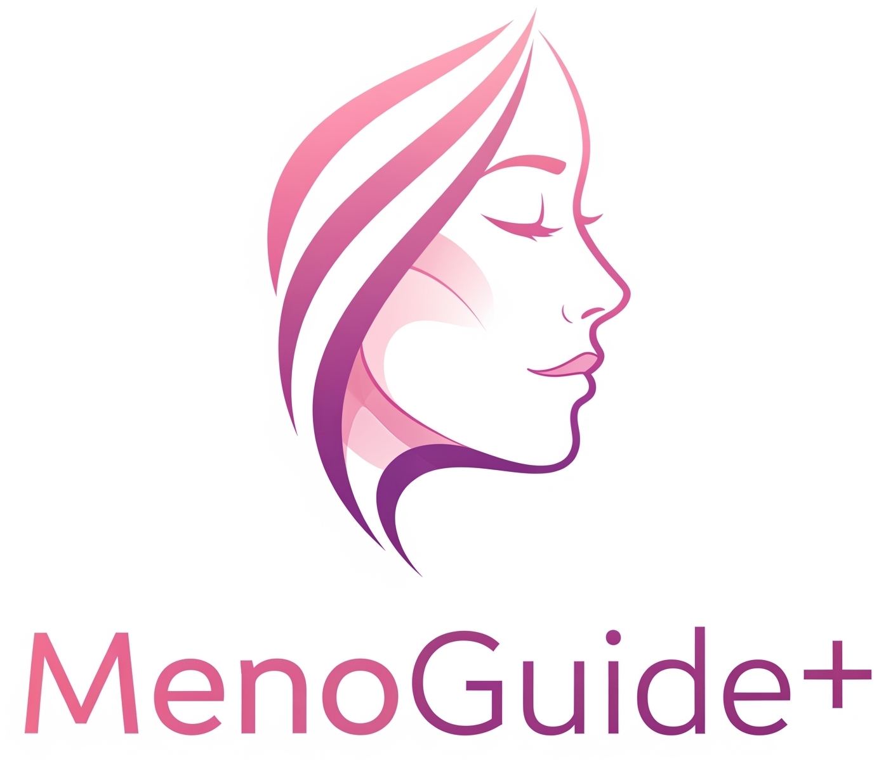
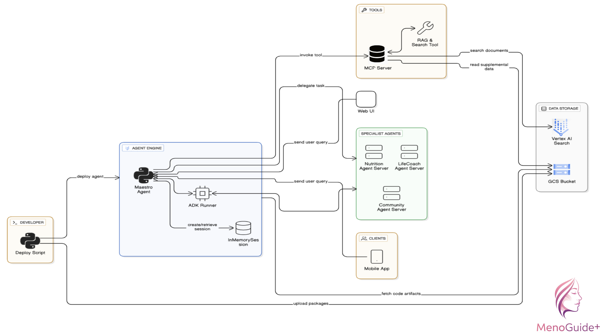
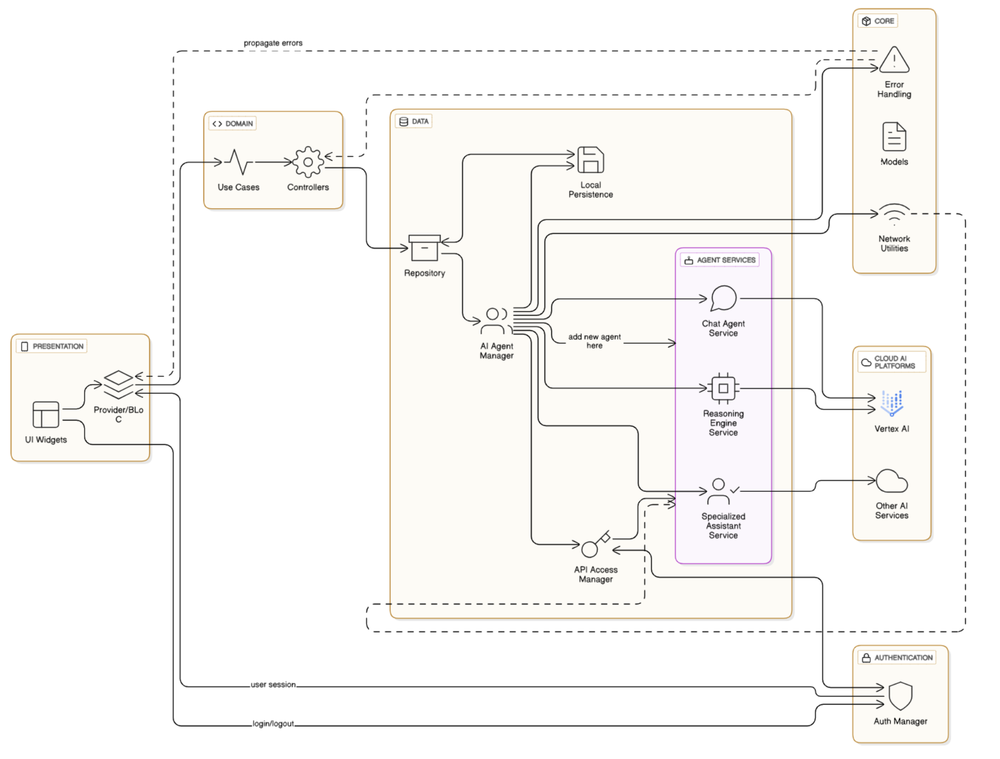

# MenoGuide+

## Table of Contents

   * [Table of Contents](#table-of-contents)
      * [About the team](#about-the-team)
      * [About our project "MenoGuide+"](#about-our-project-menoguide+)
      * [How to run](#how-to-run)
      * [Watch the demo](#watch-the-demo)
      * [License](#license)

## About the team

We are a team of 3 members:  

| AI Engineer | Team Lead | Mobile Engineer |
|:-------------------------:|:-------------------------:|:-------------------------:|
| | | |
|[Soufiane Elassri](https://github.com/soufianeelassri)| [Sara EL-ATEIF](https://github.com/elateifsara)| [Zakaria Oulamine](https://github.com/olamineZakaria) |

## About our project "MenoGuide+"

**Purpose :**
Providing personalized support for women experiencing menopause through AI-driven guidance and community connection.

**Solution :**
MenoGuide+ offers a personalized program for women in menopause, leveraging AI agents (Nutrition Expert, Life Coach, Community Connector) to provide tailored nutrition advice, emotional support, and connections to relevant communities and healthcare professionals.

**Agents Workflow Diagram**

**Architecture Diagram**

## How to run

Please check the following READMEs:

- For [Agents Services](https://github.com/soufianeelassri/MenoGuide/blob/main/agents-service/README.md)
- For [Flutter App]()

## Watch the demo

## License

See the [LICENSE](https://github.com/soufianeelassri/MenoGuide/blob/main/agents-service/LICENSE) file for license rights and limitations (MIT).
